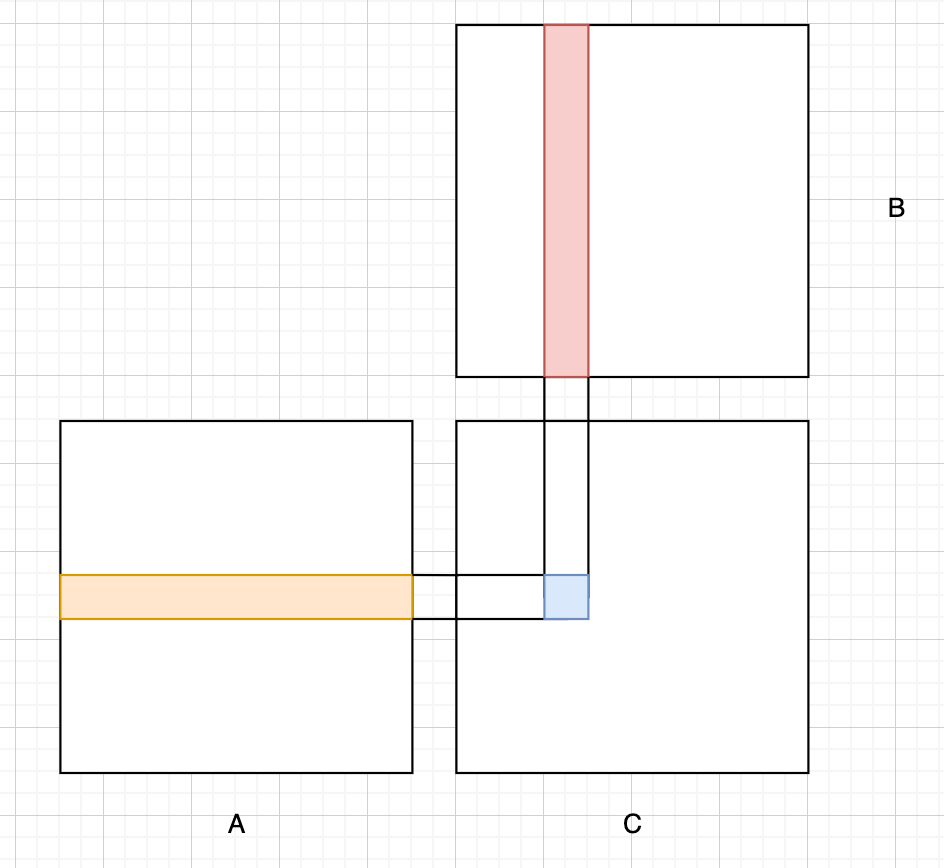
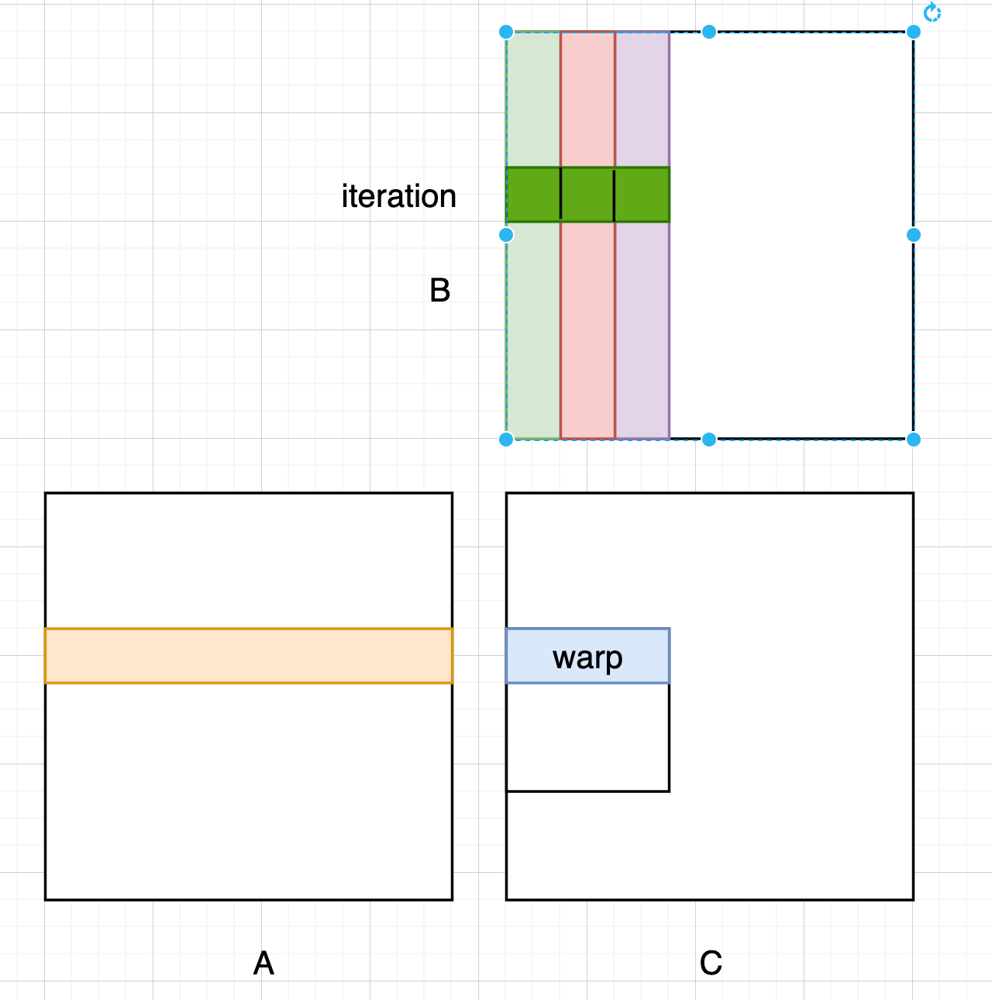
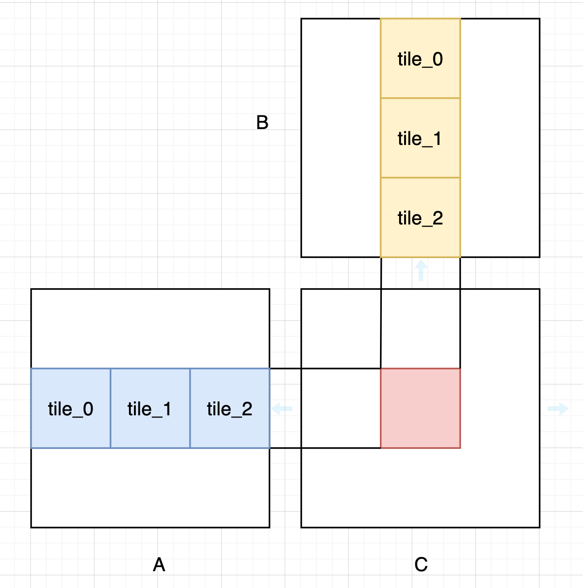
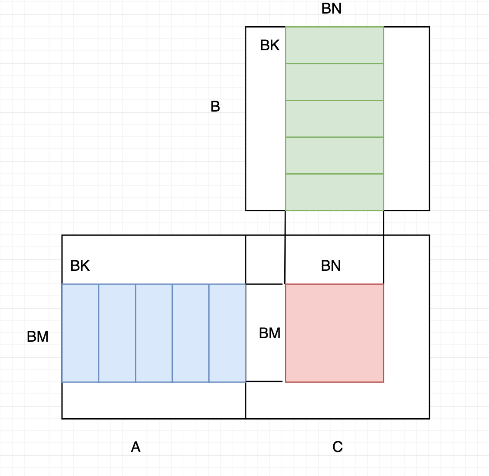
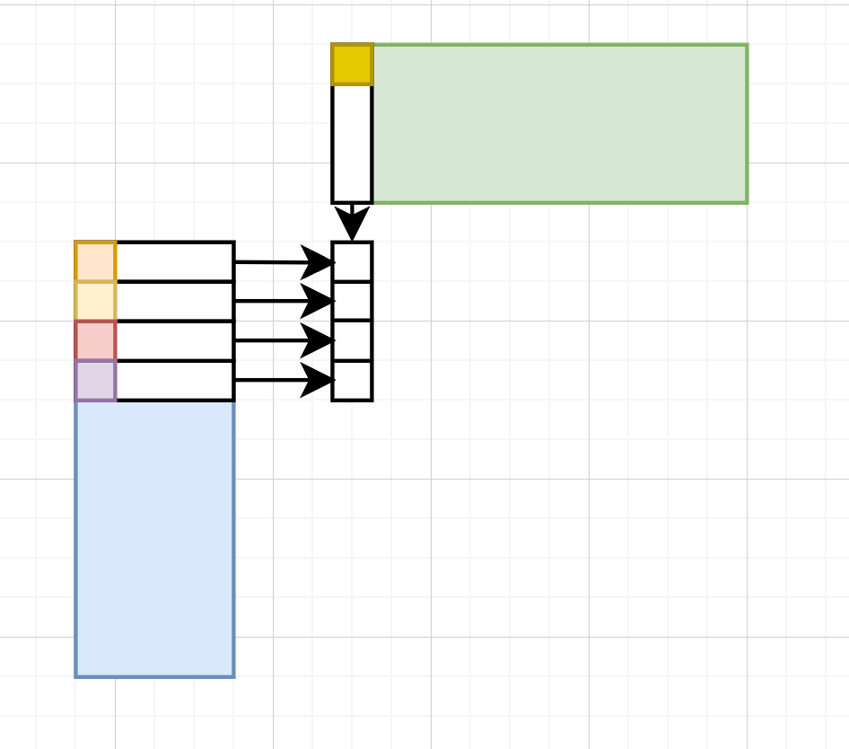
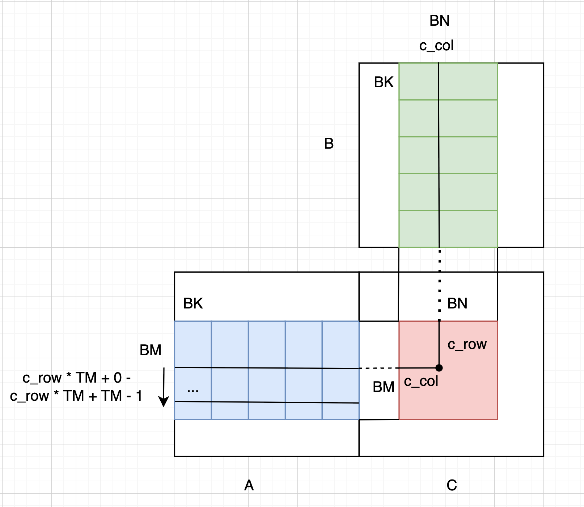
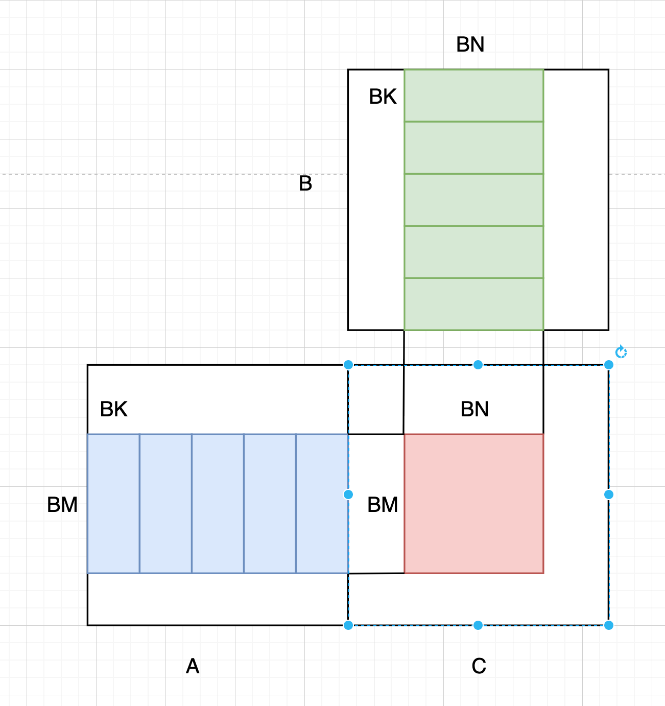

# An Optimization Procedure on Matrix Multiplication

In this article, I am going to walkthrough an optimization process of matrix multiplication. 
Here is a list of benchmarks and assumptions:
- Hardware: T4 GPU with 8.1T FLOPS
- Benchmark Matmul: CublasSgemm
- All test cases are carried out on two matrices, both with dimension (4096, 4096)
- For such two matrices, each element from the matmul requires 4096 float multiplication, 4096 float addition, and there is a total of $4096^2$ elements in the output. So the total FLOPS is $2 * 4096 * 4096^2$ = **137G FLOPS**

The following table shows the GFLOPS and time spent of each optimization:

| Optimization          | Time Spent(ms) | GFLOPS | Performance relative to cuBLAS |
|-----------------------|----------------|--------|--------------------------------|
| Naive                 | 418.0          | 327.8  | 11.3%                          |
| Tiling                | 329.0          | 416.4  | 14.4%                          |
| 1D thread-tiling      | 139.0          | 985.6  | 34.1%                          |
| 2D thread-tiling      | 94.0           | 1457.4 | 50.4%                          |
| Vectorized Mem Access | 61.0           | 2245.9 | 77.6%                          |
| cuBLAS                | 47.4           | 2893.7 | 100.0%                         |

## Naive Implementation


The above figure shows the basic idea of the naive implementation. Each element (i, j) in C initializes a thread, which reads the $i^{th}$ row of matrix A and $j^{th}$ col of matrix B. And then do a dot product in between the two vectors read, and set to the corresponding location in C.

The code is shown below. Each thread iterate through the inner dimension
```
// block_dim (32, 32)

template <const uint BLOCK_SIZE>
__global__ void matmul(float *a, float *b, float *c, int m, int k, int n) {
    int row = blockIdx.y * blockDim.y + threadIdx.y;
    int col = blockIdx.x * blockDim.x + threadIdx.x;

    float sum = 0.0f;
    for (int i = 0; i < k; i++) {
        sum += a[row * k + i] * b[i * n + col];
    }
    c[row * n + col] = sum;
}
```


### Memory Coalescing

The memory coalescing is defined as an memory accessing pattern such that the access requirements of each thread within a 
warp can be coalesced into as few transactions as possible. To understand what is going on here, let's take what we have in 
naive implementation. 

In the actual computation, a block of threads will be grouped into warps containing 32 threads. The grouping policy is based on consecutive
threadId. I.e, in our example, the block dim is (32, 32), and thread (i, j) has a threadId (i * 32 + j), which is the flatten id of the block matrix.
Therefore, each warp of this block contains each row of threads within the block.

In the matmul kernel, when we call `sum += a[row * k + i] * b[i * n + col];` in one of the iterations, 2 global memory access requirements to a and b will be initialized by the thread (i, j).
So for the 32 threads within the block, there will be 32 * 2 mem access requirements being called concurrently. However, as shown on the following figure for these 32 threads, when accessing A, they all access to the same element,
and thus these 32 requests can be coalesced into 1 transaction. As for accessing b, though each thread is required to access a col of B, however, on each iteration, these 32 threads access to a contiguous chunk of memory, i.e, partial 
row of B. Thus, per each iteration, the access requirements to B can also be coalesced into 1 transaction.



This is what so called memory coalescing, and it is always a good idea to check if the global memory access pattern for your kernel is coalesced or not.

### Analysis

Modern GPU's bottleneck is related to DRAM accessing, as the stall cycle for accessing from DRAM is exponentially larger than
arithemetic computation. So it is a good idea to check how many times our kernel need to access DRAM. In order to keep things simple, 
I will not consider mem coalesced here. 

In the naive implementation kernel:

- each thread will initialize K requests to A and B -> 2K DRAM requests per thread
- each thread is responsible for one element computation on C

Therefore, we have a total of 2K DRAM requests to compute one element.

All later optimizations will have a much smaller DRAM requests compared to this naive one, as well as a coalesced mem access pattern, 
which results in better efficiency.

## Tiling

In naive implementation, each thread within a warp will try to access the same row in A. Though with memory coalesced pattern and L1 cache (the loaded data will be at L1 cache),
the kernel will not always have to load same data again. However, we cannot control the behavior of L1 cache (at least for now), it is probable that some loaded data that haven't been used 
are evicted before using. Then these data needs to be reloaded from DRAM, or L2 cache, when needed. This is a waste of resources, and lead to an intuitive optimization: why don't we do as much as possible
on the data loaded, instead of uncontrollably let them to be evicted without being used.

Tiling is the technique built on this idea, by loading from DRAM, we do as much as we can on the loaded data. Shown on the following figure


Shown on the above graph, the kernel will iterate based on inner dimension / TILE_SIZE. At each iteration, the threads within each block will load one element from A and B, resulting in two
sub matrices with size (TILE_SIZE, TILE_SIZE) on shared memory. Compared to L1, shared memory is completely controlled by user and there will be no eviction occurring if the size of the data loaded defined by user
does not exceed the limitation. In the figure, we first load tile_0_A, tile_0_B, and do a matrix multiplication to get partial result of the pink area in C. Do same for tile_1_A, tile_1_B and tile_2_A, tile_2_B, sum
all of them together and we will get the result of the pink area. Block-wisely speaking, what tiling does differently from naive implementation is that upon loading tiles from A and B, we make sure that the data from 
these tiles are completely used before discarding. 

The code is shown here, we iterate over the inner dimension K, with a stride of TILE_SIZE.
One trick here is we advance the a, b, c ptr to the corresponding tile, such that in the iteration, the indexing will be local, which is easier.
From this optimization, I will not talk mem coalesce in too much detail. For tiling, the mem access pattern is coalesced. It is a classic coalesced
pattern: one thread for one element pattern. You can analyze yourself why this pattern is coalesced.

```cpp
template <const int TILE_SIZE>
__global__ void matmul_tile(float *a, float *b, float *c, int m, int k, int n) {
    const uint by = blockIdx.y;
    const uint bx = blockIdx.x;

    __shared__ float sharedA[TILE_SIZE][TILE_SIZE];
    __shared__ float sharedB[TILE_SIZE][TILE_SIZE];

    const uint ty = threadIdx.y;
    const uint tx = threadIdx.x;

    // advance A, B, C to corresponding tiles, such that we then only need to consider about the local index of threads
    a += by * TILE_SIZE * k;
    b += bx * TILE_SIZE;
    c += by * TILE_SIZE * n + bx * TILE_SIZE;

    float sum = 0.0f;
    for (int tile = 0; tile < K; tile += TILE_SIZE) {
        sharedA[ty][tx] = a[ty * K + tx];
        sharedB[ty][tx] = b[ty * N + tx];

        __syncthreads();

        // advance A, B again
        a += TILE_SIZE;
        b += TILE_SIZE * N;

        for (int i = 0; i < TILE_SIZE; i++) {
            sum += sharedA[ty][i] * sharedB[i][tx];
        }

        __syncthreads();
    }

    c[ty * N + tx] = sum;
}
```

### Analysis

Based on my codes, suppose the TILE_SIZE is 32, the mem access requirements will be

- GMEM access: K / 32 iterations, each iteration requires 2 GMEM access -> K / 16 GMEM accesses
- SMEM access: K / 32 * 32 * 2 = 2K -> SMEM accesses.

The time spent improved from 418 ms to 329 ms. Not a big improvement despite the largely reduced number of GMEM access. The reason is

- In naive implementation, mem is coalesced, and thus there are not that many transactions
- SMEM access also has a stall cycle around 30 cycles, though much smaller than GMEM access


## Thread Tiling - 1D

The tiling method is still far from optimized. But we can have a simple math equation to see how many access requests are needed when using tiling:
suppose A is (M, K), B is (K, N), then
- the number of accesses to A: K / TILE_SIZE
- the number of accesses to B: K / TILE_SIZE

It is natural to think by increasing the size of the tile, we can keep decreasing the number of GMEM accesses. However, the thing is we cannot improve the 
tile size without any constraints. In most modern GPU, one block can contain at most 1024 threads, one warp within a block can at most use up to 32 KB shared mem, 
and one thread can have at most 64 registers. By doing some simple math, you will easily find that the tiling method introduced before has bottleneck on threads per block.

So, are there any ways to hide this bottleneck? To be more clear, can we create a larger tile, while still keep the resources used the same, such that
the DRAM access requirements will be reduced. The answer is yes, we can use thread tiling, which basically lets each thread to do more computations, such that
the thread constraints is satisfied, or even improved, as less threads can make one SM to load more blocks together, which hides the latency during GMEM accessing.

This method has a really clever design, which might seem unintuitive when you first look at it. I will try my best to explain this technique both mathematically and 
intuitively. Once you have known this technique, you will obtain a methodology that helps you to fasten your code.


Shown on the above is how the so called thread tiling 1d works. We have 4 variables, BM, BK, BN and TM, where
- BM: first dim of tile of A 
- BN: second dim of tile of B
- BK: inner dim of tile of A and B
- TM: by doing tiling logic, we will have BM * BN computed results of C, BM * BN > 1024 (as we want a larger tiling than (32, 32)),
so TM is the number of elements each thread is responsible for computing.

### Mathematical understanding
In order to achieve mem coalesced access pattern, we still want our threads to load 1 element from both A and B at each iteration. i.e
BM * BK = BM * BN / TM. Also, to make things simple, we want our BM = BN. Then we have these 2 constraints
- BM = BN
- BK * TM = BM = BN

For example, if we set BM = BN = 64, then, TM can be 4, and BK can be 16, TM and BK can both equal to 8, and etc.

### Intuitive understanding
Our aim is to have a larger tile in C, as well as to keep the resources required the same, or even reduce. Let's see it block wisely instead of thread wisely, 
what we have done here is, the block enables us to compute BM * BN elements. If we set BM and BN to be 64, we can regard it as having a tile of size (64, 64).
Based on the formula we derived previously in the section tiling, we know that the GMEM access requirements is reduced by 50%, i.e
K / 32. 

### Implementation
We have a great trick here, which can be used in many other cases, to implement this technique. We initialize our block as a flattened array of threads.
The reason for this is that tile A and tile B has different dimension, and it is easier to manipulate a 1D array of threads into different 2D systems than
manipulate a 2D arrays into different 2D systems.

In my code shown below, I chose BM = BN = 64, BK = 4, TM = 16, which is the fastest combination that I tested. For such setup, we have
threads equal to 64 * 64 / 16 = 256 threads. To make threads have same layout as tile A, we simply do `a_row = threadIdx.x / BK` and `a_col = threadIdx.x % BK`.
Similarly, to make threads have same layout as B, we simply do `b_row = threadIdx.x / BN` and `b_col = threadIdx.x % BN`. Which 16 elements would a thread compute? The natural way
is to compute 16 col elements in the tile_c. Which thus lead us to find the thread row and col in c, i.e, `c_row = threadIdx.x / BN` and `c_col = threadIdx.x % BN`, with a stride of 16 along the col.

When reading from the shared memory, we can do another for improved SMEM access. The natural way is we set TM as outer loop, and inner loop is based on BK, as shown in the following
```cpp
for (uint i = 0; i < TM; i++) {
    for (uint j = 0; j < BK; j++) {
        tmp = shared_A[(c_row + i) * BK + j] * shared_B[j * BN + c_col];
    }
}
```
Then, we have accessed TM times same elements in shared_B. Shown on the following graph is the optimization. Noticing that, 
for BK elements the current thread is responsible for, the 0^th element from tile_A of all BK elements in result will be multiplied by the same element, which is labeled as yellow in tile B.
So we can set our outer loop based on BK, and read the corresponding element from tile B into register, and the inner loop is based on TM, that each 
element read from A will multiply that element from tile B read previously.


_Aside_: Modern compiler is optimized enough to find repeated accessing. Therefore, even if you wrote the same as naive way, you would
still have the optimized PTX instructions.


The complete code is shown as follows. It is not easy to understand at first. Pay some time to understand it, and focus more on how to manipulate with the indices in between different dimension systems shown on the above figure.
```cpp
template <const int BM, const int BN, const int BK, const int TM>
__global__ void matmul_bl(float *a, float *b, float *c, int m, int k, int n) {
    const uint by = blockIdx.y;
    const uint bx = blockIdx.x;

    // the thread idx in the current block of output c
    const uint c_row = threadIdx.x / BN;
    const uint c_col = threadIdx.x % BN;

    __shared__ float sharedA[BM * BK];
    __shared__ float sharedB[BK * BN];

    // move block ptr such that the rest logic can be done on local indices
    a += by * BM * k;
    b += bx * BN;
    c += by * BM * k + bx * BN;

    // check the requirement
    assert(BM == BN);
    assert(BM * BK == blockDim.x);

    // compute the local indices of each thread in tile A and tile B
    const uint a_row = threadIdx.x / BK;
    const uint a_col = threadIdx.x % BK;
    const uint b_row = threadIdx.x / BN;
    const uint b_col = threadIdx.x % BN;

    // allocate cache for TM results in registerfile
    float thread_res[TM] = {0.0f};

    // outer loop is the tile movement along inner dimension
    for (int blkId = 0; blkId < k; blkId += BK) {
        // load element from a and b
        sharedA[a_row * BK + a_col] = a[a_row * k + a_col];
        sharedB[b_row * BN + b_col] = b[b_row * n + b_col];

        __syncthreads();

        // move a and b pointer
        a += BK;
        b += BK * n;

        /*
            here, we begin to calculate the partial sum of each tile a and b pair
            the usually is to put TM as outer loop, and BK as inner loop, i,e
            for (int i = 0; i < TM; i++) {
                for (int j = 0; j < BK; j++) {
                    thread_res[i] += element from shared_a and from shared_b
                }
            }
            this will cause extra read from shared_b. One clever way is to make BK as the outer row, and for each
            outer loop, we only need to read 1 element from shared_b for the inner loop

            But the current compiler is smart enough such that for both ways, it will optimize the access times on shared b
        */
        for (int i = 0; i < BK; i++) {
            float tmp = sharedB[i * BN + c_col];
            for (int j = 0; j < TM; j++) {
                thread_res[j] += sharedA[(c_row * TM + j) * BK + i] * tmp;
            }
        }
        __syncthreads();    
    }
    // put the results into c
    for (int i = 0; i < TM; i++) {
        c[(c_row * TM + i) * n + c_col] = thread_res[i];
    }
}
```

### Analysis
- GMEM accesses: K / 4 iterations * 2 / 16 elements per thread -> K / 32 GMEM accesses per element
- SMEM accesses: K / 4 iterations * 4 * (1 + 16) accesses / 16 -> $\frac{17}{16}K$ SMEM accesses per element.
And We have a huge improvement using this technique, from 329 ms to 139 ms.


## Thread tiling - 2D

We can improve the thread tiling further, i.e, improve BM and BN by letting the thread to do more jobs in different dimension.
We can keep our mem access pattern as loading one element per thread, but in order to the last optimization skill to show up, I will
make this kernel as to load more elements than one (And it is faster compared to only load one element, because of less instruction overhead, or less iterations)

Shown on the following figure, the only difference between thread tiling 2d and thread tiling 1d is that in thread tiling 2d, each thread is going to compute TM * TM 
elements. So, the thread number will be $\frac{BM * BN}{TM * TM}$. When switching the threadIdx.x into 2D layout, we have
- `c_row = threadIdx.x / (BN / TM)`
- `c_col = threadIdx.x % (BN / TM)`


BK depends on how many elements we plan to load for each thread, to make things simple, let's use this setting:
BM = BN = 128, BK = 8, TM = 8 * 8 = 64, which leads to
- num_threads: 128 * 128 / 64 = 256
- num_elements_load: 128 * 8 / 256 = 4

When loading from tiles, we can either have each thread to load 4 elements consecutively along a column, or with a stride BM / 4 when loading tile A and BK / 4 when loading tile B.
Either way is acceptable and equally coalesced. 

```cpp
template <const uint BM, const uint BN, const uint BK, const uint TM>
__global__ void matmul_bl2d(float *a, float *b, float *c, int m, int k, int n) {
    const uint by = blockIdx.y;
    const uint bx = blockIdx.x;

    // indices of the thread in the block of the output c
    const uint c_row = threadIdx.x / (BN / TM);
    const uint c_col = threadIdx.x % (BN / TM);
    
    const uint num_threads = BM * BN / (TM * TM);

    // allocate shared memory
    __shared__ float shared_A[BM * BK];
    __shared__ float shared_B[BK * BN];

    // move block ptr
    a += by * BM * k;
    b += bx * BN;
    c += by * BM * k + bx * BN;

    // get local indices of the threads within tile a and tile b
    const uint a_row = threadIdx.x / BK;
    const uint a_col = threadIdx.x % BK;
    const uint a_stride = num_threads / BK;
    const uint b_row = threadIdx.x / BN;
    const uint b_col = threadIdx.x % BN;
    const uint b_stride = num_threads / BN;

    // use registers to store row and col
    float thread_res[TM * TM] = {0.0f};
    float thread_r[TM] = {0.0f};
    float thread_c[TM] = {0.0f};

    // we load BM / a_stride elements from a, and BK / b_stride elements from b per thread
    for (int blkId = 0; blkId < k; blkId += BK) {
        for (uint offset = 0; offset < BM; offset += a_stride) {
            shared_A[(a_row + offset) * BK + a_col] = a[(a_row + offset) * k + a_col]; 
        }
        for (uint offset = 0; offset < BK; offset += b_stride) {
            shared_B[(b_row + offset) * BN + b_col] = b[(b_col + offset) * n + b_col];
        }

        __syncthreads();

        a += BK;
        b += BK * n;

        // we load one col of length TM from shared_A, and one row of length TM from shared_B
        for (int dotId = 0; dotId < BK; dotId++) {
            for (int i = 0; i < TM; i++) {
                thread_r[i] = shared_A[(c_row * TM + i) * BK + dotId];
            }
            for (int i = 0; i < TM; i++) {
                thread_c[i] = shared_B[dotId * BN + c_col * TM + i];
            }
            for (uint res_r = 0; res_r < TM; res_r++) {
                for (uint res_c = 0; res_c < TM; res_c++) {
                    thread_res[res_r * TM + res_c] += thread_r[res_r] * thread_c[res_c];
                }
            }
            __syncthreads();
        }
    }

    for (uint res_r = 0; res_r < TM; res_r++) {
        for (uint res_c = 0; res_c < TM; res_c++) {
            c[(c_row * TM + res_r) * N + c_col * TM + res_c] = thread_res[res_r * TM + res_c]; 
        }
    }
}
```

### analysis

- GMEM: K / 8 * (4 + 4) / 64 = K / 64
- SMEM: K / 8 * 8 * (8 + 8) / 64 = K / 4

thread_res is a register file, the stall cycle can be neglected compared to GMEM access and SMEM access

## Vectorized mem access

Besides warp level memory coalescing, we also have thread-level memory access optimization technique, i.e, vectorized memory load.
The vectorized mem access instruction allows the user to access 4 floats at the same time, instead of load it one by one in the iteration.
To use vectorized mem access, we need to make sure that each thread loads a consecutive chunk of elements, i.e, we are not loading along the column, 
instead, along the row. 

Admittedly, when loading along rows, there might be mem coalescing issue, however, vectorized load helps to

- reduce instructions overhead, as now we don't need a loop to load element separately in the code
- reduce mem driver overhead, as now each thread has only two (both A and B) loading instructions
- avoid the serial behavior of elements loading. Since if we are using a loop, we implicitly making the loading process serial, but the loading of the 4 elements should be concurrent.

And yes, this technique helps me to get a even faster matmul efficiency, from 94ms to 61ms.

## To Be Continued

There are still a bunch of ways for optimizing

- BM, BN, TM, BK are like hyperparameters, they are variant on different hardware, different dimensions, etc. So we can write a auto tuning code to find optimal hyper parameter set
- Transpose A such that the elements we load in one transaction will be useful for all threads. (In our 128 * 8 case, one transaction will load 32 elements from a row, but we only need 8 for a warp)
- Warptiling
- Pre-fetch
- ...


