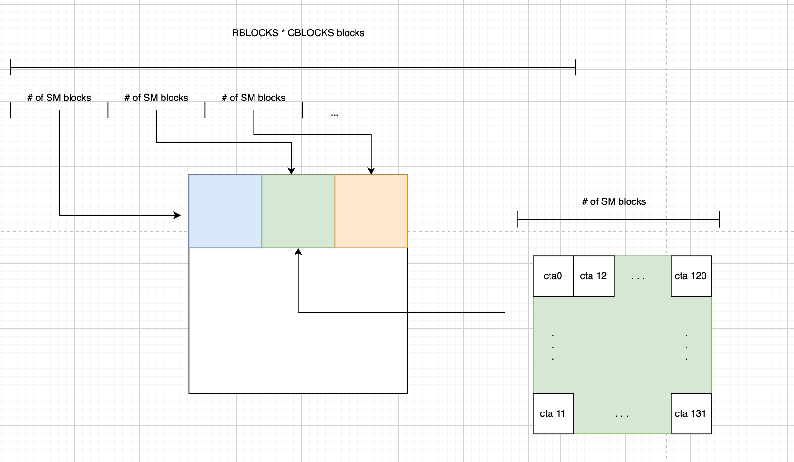

# A review on how to use tensor core for matmul, and how TK implement it

## 1 A review of tiling

Shown on the following graph is the basic idea of tiling. The blue square in the graph is called the block tile, meaning that one block of threads
in the kernel layout is responsible for computing such a tile on C. 

The most important reason for using tiling is that it largely reduces the number of GMEM accesses. The reduction is proportional to the size of the block tile, i.e
the larger the block size, the less the GMEM accesses. However, we can not infinitely increase the block tile size, as the size of SMEM is limited.

## 2 Modern GPU architect

Modern GPU makes 2 things faster

- faster matmul between tiles from A and tiles from B faster, supported by tensor core
- faster GMEM load and store process enabled by TMA (tensor memory accelerator)

## 3 Efforts to fasten matmul

The matmul kernel can be generalized into the following process, in a very high level way

- load: load tiles from A and B onto SMEM
- compute: multiply and accumulate the matmul result of tiles from A and B, and put the result into SMEM
- store: store the result of the block tile of C back to GMEM

With such a process, one can expect that, by applying TMA and tensor core, we can reach a faster matmul.
However, to explore the potential of modern GPU, more efforts are required. And in this section, I will introduce
3 most important techniques to fasten the matmul process

### 3.1 Persistent block

One way to understand persistent block is that, I create multiple logical block containers. Within each block container, 
we iteratively do a block of tasks until all tasks are completed.

What persistent block scheme brings us are:

- Reduction for kernel launch overhead. We can write two initially unfusable kernels into one kernel, and let the block container pull
the iteratively pull the blocks without having to launch new kernels.
- SMEM, cache and reg reuse: Since now the hardware will only see 132 blocks. We can design pattern such that the blocks that will be 
pulled by the current block container requires same data
- Asynchronous loading for next block: When the block container is executing the current block, we can asynchronously load the data required for the next block.

One other important benefit from persistent block is related to cta swizzling, where we can dynamically set the blockId for the block of tasks the current
iteration is doing, such that CTA swizzling can be achieved. More information will be provided in the next section.

### 3.2 CTA swizzling

CTA swizzling is a technique that is lack of official documents, but bringing substantial improvement on efficiency. 

#### 3.2.1 Normal CTA layout and its limitation

When we are creating grid layout, we are used to let the grid layout to have similar shape as the output. For example, when we are doing matmul kernel, what we usually do is,

- set the block tile size tile_M and tile_N
- set the grid layout as (N / tile_N, M / tile_M)

For example, suppose A is a matrix of 128 by 64, and B is a matrix of 64 by 256, the matmul result C of A and B is 128 by 256.
The block tile is (64, 64), resulting in a grid layout of (4, 2) shown on the following graph. And we can use blockIdx.x and blockIdx.y to access
to the actual position in C that one block will be responsible for.

For simplicity, we will assume one SM can only hold one block we created, and we only have 4 SMs. 
Consider the following case, block (0, 0), block (1, 0), block (2, 0) and block (3, 0) are currently on our hardware.
In such a case, although all blocks need the same data from A, each block requires a different cols of data from B. 
Then, in such case, after we load the blue part from A, we might benefit from leading this blue part for other blocks from
L2 cache. But since blocks require cols from B differently, there is no chance to benefit from L2 cache to load B. To be more
mathematical, theoretically, we need 5 GMEM loads, and 3 L2 loads.

#### 3.2.2 CTA swizzling = Better L2 cache hit

It is important to have a mindset that, we don't need to make our grid layout similar to output. We can flexibily determine what block tile this block will be responsible for.
In order to achieve this, what we usually do is first, initialize the grid layout as a 1D array. And do the indexing to the corresponding block tile on C manually.
I.e, the map between block Id and the corresponding block tile it is responsible for is decoupled and flexible. 

Shown on the following graph, if we can have our hardware to execute block 0, 1, 2, 3 on the SMs, we only need
4 GMEM accesses, and 4 other accesses will be from L2 cache.

The idea of increasing the L2 cache hit for all the blocks currently on the SMs is exactly the aim of CTA swizzling. And it is easy to notice that,
we want our blocks to be responsible for a square-ish area on C such that the L2 cache hit will be maximized. And because of such a requirement, it is easier
to initialize the grid layout as a 1D array, and do the indexing accordingly.

#### 3.2.3 Math

Now, let's turn to the hardcore part, how to actually do the indexing.

Our task is to do a matmul. And each block is responsible for a tile_M * tile_N block tile on C.
Suppose A is M by K, and B is K by N. Then, we will have a total number of RBLOCKS * CBLOCKS blocks, where
RBLOCKS = M / tile_M and CBLOCKS = N / tile_N.

Our indexing task is shown below

- Initially, we have RBLOCKS * CBLOCKS blocks aligned as a 1D array
- We partition the block array with a stride of the number of SMs
- In each sub group of blocks, we want to align the blocks as forming a square-ish area of output C
- If I have 132 SMs, then for the green subgroup, I will align the 132 blocks in a column-major manner. Note that the
block id is the local id corresponding to the subgroup.

In the graph above, I abstractly set that there are 12 blocks on a column of the square-ish area, i.e, you can see that I align cta0 - cta11 on the same column.
This value, 12, is a abstract value that depends on the developer. And from now on, I will use super_M to denote it.

Now, our task can be reduced to:
Given a block id, we want to extract the corresponding indexing of the block tile based on super_M and the description of layout requirement above.
For simplicity, I will assume RBLOCKS is divisible by super_M. In TK, we actually have a logic to deal with the case when RBLOCKS is not divisible by super_M, but the computation is 
similar. I will talk about it when we actually see the code

To compute the block tile index, one trick here is, we can take super_M * CBLOCKS as a super block. Then, if we know the local index
of the block, we can transform the index to 2D based on a column major layout. Let's denote super_M * CBLOCKS as super_repeat
Shown on the following graph, given a global index blockId, we can get the local index as

- local_index = blockId - (blockId / super_repeat) * super_repeat 

Now we get the local index, the way to transform to 2D is:

- local row: local_index % super_M
- local col: local_index / super_M

We can see that local_col is actually the global col. But we still need to know the offset of how many super block, which is

- blockId / (super_repeat)

Each super block contains super_M rows of blocks, and thus the offset will be 

- (blockId / super_repeat) * super_M

To clean up, given a blockId, we now have:

- row: (blockId / super_repeat) * super_M + (blockId - (blockId / super_repeat) * super_repeat) % super_M
- col: (blockId - (blockId / super_repeat) * super_repeat) / super_M

We can actually make the formula easier, note that, for the equations
- (blockId - (blockId / super_repeat) * super_repeat) % super_M, (blockId / super_repeat) * super_repeat must be divisible for super_M, for an equation like (x + y) % m, where y is divisible by m, 
the formula is simply x % m. 
- (blockId - (blockId / super_repeat) * super_repeat) is actually blockId % super_repeat

So, we can have a cleaner set of equations

- row: (blockId / super_repeat) * super_M + blockId % super_M
- col: (blockId % super_repeat) / super_M

#### 3.2.4 CTA swizzling and persistent block

Till now, our theory builds upon one assumption, that the SM will select the block serially. I.e,  
all blocks of a subgroup will be selected for execution simultaneously. However, it is not always the case. Shown on the following 
graph, even with correct indexing, the block scheduler will not select the block serially, but rather a random manner.
As shown in the following graph, blocks from different subgroup might be selected, causing the swizzling layout to be ineffective.

With the help of persistent block, this problem can be resolved completely. Recall that for persistent block, we created 132 (on Hopper) 
block containers to iteratively load block of tasks onto it, and execute the tasks. In such a manner, we can dynamically give the block Id for a block that is loaded within 
an interation.

### 3.3 Asynchronous i/o and compute

Beginning from Ampere, many instructions are made asynchronous, for example, loading and compute(on Hopper). The asynchrony creates a large potential for overlapping.
Recall that, matmul can be generalized into 3 steps:
1. load data
2. compute
3. store

If we can concurrently do the computation and data loading, then, a large amount of latency will be hided.
This technique is called n-stage pipelining. Where we prefetch n-1 tiles from A and B respectively, and then 
enter the loop. Within the loop, we will compute one tiles of already loaded tile, and also launch a tma loading of tiles for future computation.

The following graph shows how the value of n affects the efficiency, as you can see, with a larger n, we are more close to a state that compute never waits on 
the loading, i.e, the computation unit is always occupied, which is what we want.

#### 3.3.1 Producer-Consumer model

The best practice to exploit the asynchrony, and reach a state of concurrently doing load and compute is the producer-consumer model. 

##### 3.3.1.1 mbarrier

Things related to asynchrony are complicated, not only on CPU but also on GPU. 
In this section, I am going to introduce the techniques Hopper architect has for handling asynchronous tasks.

mbarrier is the component that modern GPU applies for handling asynchrony. To be more specific, mbarrier is used to 
check whether an asynchronous task is finished or not. From hardware level, mbarrier is
a 64 bit long data stored on a SMEM. There are 3 parts that worth to be noted in this 64 bit data
- Phase bit: a 0 or 1 bit that denotes the current phase of the asynchronous task
- arrival_count: denoting the participants of this asynchronous task. 
- expect_tx: denoting the bytes that will be loaded by the async load process

